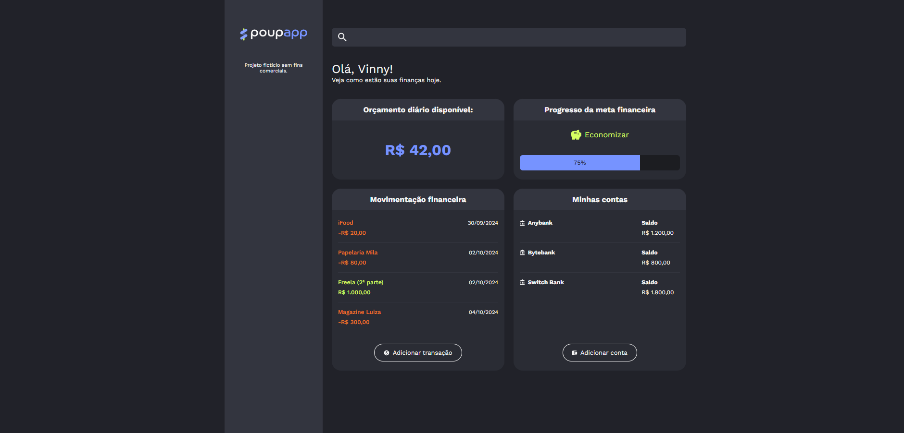

# PoupApp

Um aplicativo de gestão financeira pessoal desenvolvido com React e Vite. Acompanhe suas despesas, controle seu orçamento diário e monitore suas metas de poupança.

## Preview



## Funcionalidades

- **Orçamento Diário**: Visualize quanto você tem disponível para gastar no dia
- **Meta Financeira**: Acompanhe o progresso em relação às suas metas de poupança
- **Movimentação Financeira**: Veja todas as suas transações em um só lugar
- **Gerenciamento de Contas**: Organize suas contas bancárias e carteiras

## Tecnologias

- **React** - Biblioteca JavaScript para construção de interfaces
- **Vite** - Build tool rápido e moderno
- **Tailwind CSS** - Framework CSS utilitário
- **CSS Modules** - Estilos encapsulados por componente

## Instalação

1. Clone o repositório
2. Instale as dependências:
```bash
npm install
```

## Desenvolvimento

Para iniciar o servidor de desenvolvimento:
```bash
npm run dev
```

## Build

Para criar uma build de produção:
```bash
npm run build
```

## Estrutura do Projeto

```
src/
├── components/          # Componentes reutilizáveis
│   ├── Aside/          # Barra lateral
│   ├── Card/           # Componente de card
│   ├── Container/      # Container principal
│   ├── DailyBudget/    # Orçamento diário
│   ├── Main/           # Conteúdo principal
│   ├── SearchInput/    # Campo de busca
│   ├── SavingsStatus/  # Status da meta
│   ├── Transactions/   # Lista de transações
│   └── ...
├── assets/             # Imagens e ícones
├── App.jsx             # Componente raiz
└── main.jsx            # Ponto de entrada
```

